# 📚 Nexskill LMS Database Schema Walkthrough

A comprehensive visual guide to understanding our database structure, relationships, and terminology.

---

## 🔤 Key Database Terminology

Before diving in, let's understand some key terms:

| Term | Definition | Example |
|------|------------|---------|
| **Table** | A collection of related data organized in rows and columns (like a spreadsheet) | `profiles`, `courses` |
| **Column/Field** | A single piece of information in a table | `first_name`, `email` |
| **Row/Record** | A complete set of data for one item | One specific user's profile |
| **Primary Key (PK)** | Unique identifier for each row, usually `id` | `uuid`, `bigint` |
| **Foreign Key (FK)** | A column that links to another table's primary key | `course_id` referencing `courses.id` |
| **UUID** | Universally Unique Identifier - a 36-character random ID | `a1b2c3d4-e5f6-7890-abcd-ef1234567890` |
| **Junction Table** | A table that connects two tables in a many-to-many relationship | `course_topics` connects `courses` and `topics` |
| **JSONB** | PostgreSQL data type for storing JSON objects | `content_blocks` in lessons |
| **Constraint** | Rules that enforce data integrity | `CHECK`, `UNIQUE`, `NOT NULL` |
| **Timestamp** | Date and time value | `created_at`, `updated_at` |

---

## 🗂️ Tables by Category

Our database has **37 tables** organized into **7 main categories**:

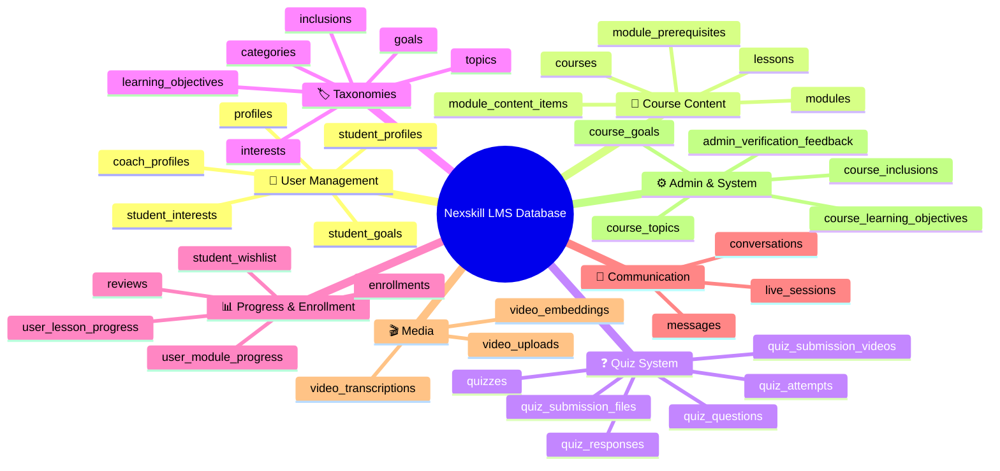

---

## 👤 Category 1: User Management

These tables store information about all users in the system.

### High-Level Relationship Diagram

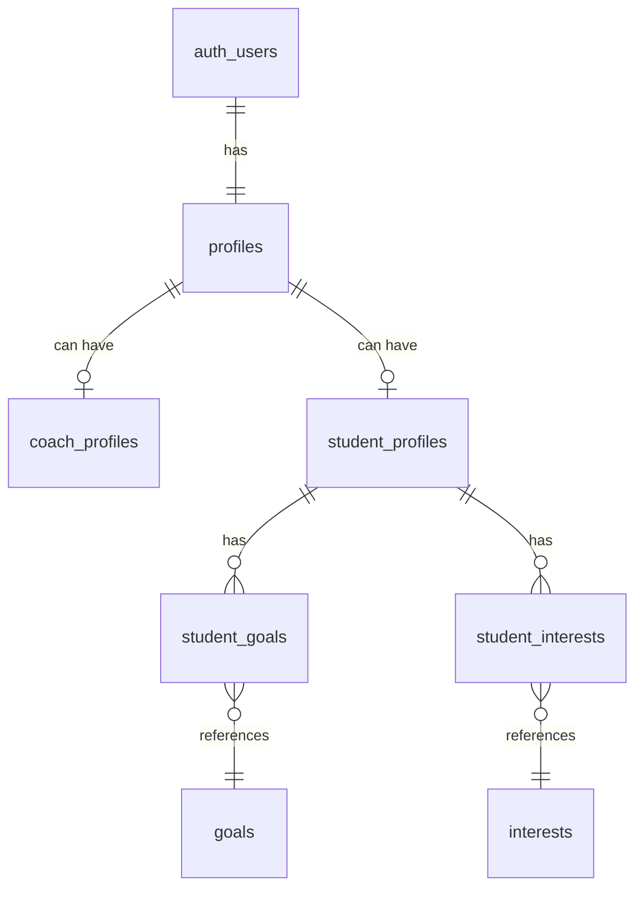

### 📋 [profiles](file:///c:/Users/Emmanuel/Documents/FinalNexskill/nexskill-lms)
> **Purpose:** Core user profile for ALL users (students, coaches, admins)

| Column | Type | Description |
|--------|------|-------------|
| `id` | uuid (PK, FK→auth.users) | Links to Supabase auth user |
| `username` | text | Unique username (min 3 chars) |
| `email` | text | Unique email address |
| `first_name` | text | User's first name |
| `last_name` | text | User's last name |
| `middle_name` | text | User's middle name |
| `name_extension` | text | Suffix like Jr., Sr., III |
| `role` | text | One of: `student`, `coach`, `admin`, `unassigned` |
| `updated_at` | timestamp | Last profile update time |

> [!NOTE]
> The `profiles` table is the **central user table**. Both `coach_profiles` and `student_profiles` extend it with role-specific data.

---

### 📋 [coach_profiles](file:///c:/Users/Emmanuel/Documents/FinalNexskill/nexskill-lms)
> **Purpose:** Extended profile information for coaches only

| Column | Type | Description |
|--------|------|-------------|
| `id` | uuid (PK, FK→profiles) | Same ID as their profiles record |
| `job_title` | text | Coach's job title |
| `bio` | text | Coach biography |
| `experience_level` | text | Experience level |
| `content_areas` | array | Areas of expertise |
| `tools` | array | Tools/software they know |
| `linkedin_url` | text | LinkedIn profile URL |
| `portfolio_url` | text | Portfolio website URL |
| `verification_status` | text | `pending`, `verified`, or `rejected` |
| `created_at` / `updated_at` | timestamp | Timestamps |

---

### 📋 [student_profiles](file:///c:/Users/Emmanuel/Documents/FinalNexskill/nexskill-lms)
> **Purpose:** Extended profile information for students only

| Column | Type | Description |
|--------|------|-------------|
| `id` | uuid (PK) | Unique student profile ID |
| `user_id` | uuid (FK→auth.users) | Links to auth user |
| `first_name` / `last_name` | varchar | Student's name |
| `headline` | text | Profile headline |
| `bio` | text | Student biography |
| `current_skill_level` | varchar | `Beginner`, `Intermediate`, or `Advanced` |
| `created_at` / `updated_at` | timestamp | Timestamps |

---

### 📋 [student_goals](file:///c:/Users/Emmanuel/Documents/FinalNexskill/nexskill-lms) & [student_interests](file:///c:/Users/Emmanuel/Documents/FinalNexskill/nexskill-lms)
> **Purpose:** Junction tables linking students to their selected goals and interests

These follow the same pattern:
- `student_profile_id` → links to `student_profiles`
- `goal_id` / `interest_id` → links to `goals` / `interests` lookup tables

---

## 📖 Category 2: Course Content

The heart of the LMS - courses, modules, and lessons.

### Hierarchy Visualization

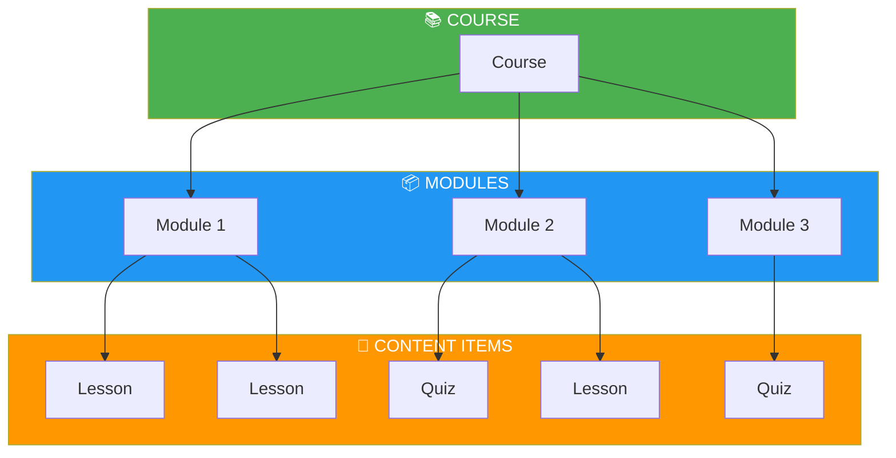

### Content ERD

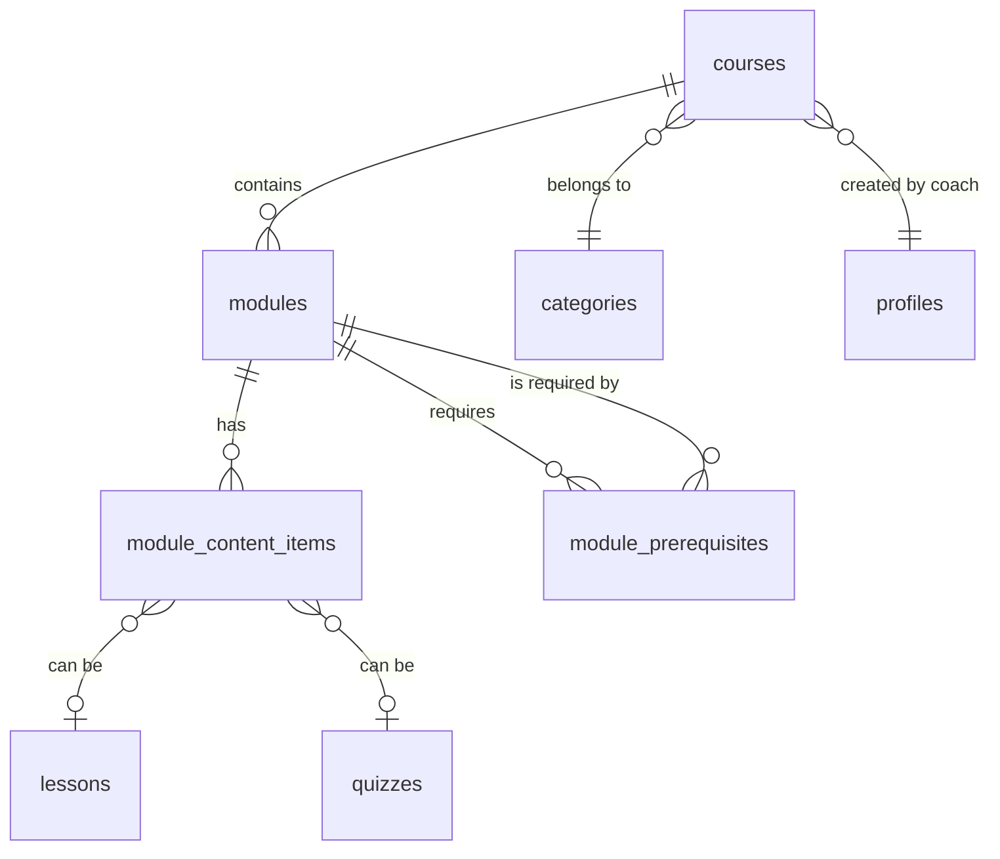

---

### 📋 [courses](file:///c:/Users/Emmanuel/Documents/FinalNexskill/nexskill-lms)
> **Purpose:** Main course entity - everything about a course

| Column | Type | Description |
|--------|------|-------------|
| `id` | uuid (PK) | Unique course identifier |
| `title` | text | Course title |
| `subtitle` | text | Course subtitle |
| `short_description` | text | Brief description |
| `long_description` | text | Full description |
| `level` | enum | `Beginner`, `Intermediate`, `Advanced` |
| `duration_hours` | numeric | Total course duration |
| `price` | numeric | Course price (0 = free) |
| `language` | text | Course language (default: English) |
| `visibility` | text | `public`, `unlisted`, or `private` |
| `verification_status` | enum | `draft`, `pending`, `verified`, `rejected` |
| `category_id` | bigint (FK) | Course category |
| `coach_id` | uuid (FK→profiles) | Course instructor |
| `created_at` / `updated_at` | timestamp | Timestamps |

> [!IMPORTANT]
> Courses must go through a **verification workflow**: `draft` → `pending` → `verified` (or `rejected`)

---

### 📋 [modules](file:///c:/Users/Emmanuel/Documents/FinalNexskill/nexskill-lms)
> **Purpose:** Sections/chapters within a course

| Column | Type | Description |
|--------|------|-------------|
| `id` | uuid (PK) | Unique module identifier |
| `course_id` | uuid (FK→courses) | Parent course |
| `title` | text | Module title |
| `description` | text | Module description |
| `position` | integer | Order within course |
| `is_published` | boolean | Publication status |
| `is_sequential` | boolean | Must complete in order? |
| `drip_mode` | text | Content release mode |
| `drip_days` | integer | Days delay (if applicable) |
| `drip_date` | timestamp | Specific release date |
| `owner_id` | uuid | Module owner |

**Drip Modes Explained:**
- `immediate` - Available instantly
- `days-after-enrollment` - Unlocks X days after enrollment
- `specific-date` - Unlocks on a specific date
- `after-previous` - Unlocks after completing previous module

---

### 📋 [lessons](file:///c:/Users/Emmanuel/Documents/FinalNexskill/nexskill-lms)
> **Purpose:** Individual learning units with content

| Column | Type | Description |
|--------|------|-------------|
| `id` | uuid (PK) | Unique lesson identifier |
| `title` | text | Lesson title |
| `description` | text | Lesson description |
| `content_blocks` | jsonb | Rich content (text, video, images, etc.) |
| `estimated_duration_minutes` | integer | Expected completion time |
| `is_published` | boolean | Publication status |
| `completion_criteria` | jsonb | How to mark as complete (e.g., `{"type": "view"}`) |
| `created_at` / `updated_at` | timestamp | Timestamps |

> [!TIP]
> The `content_blocks` field uses JSONB to store flexible, block-based content similar to Notion or Medium.

---

### 📋 [module_content_items](file:///c:/Users/Emmanuel/Documents/FinalNexskill/nexskill-lms)
> **Purpose:** Links modules to their content (lessons OR quizzes)

| Column | Type | Description |
|--------|------|-------------|
| `id` | uuid (PK) | Unique identifier |
| `module_id` | uuid (FK→modules) | Parent module |
| `content_type` | text | Either `lesson` or `quiz` |
| `content_id` | uuid | ID of the lesson or quiz |
| `position` | integer | Order within module |
| `is_published` | boolean | Visibility status |

> [!NOTE]
> This is a **polymorphic association** - `content_id` can reference either `lessons` or `quizzes` based on `content_type`.

---

### 📋 [module_prerequisites](file:///c:/Users/Emmanuel/Documents/FinalNexskill/nexskill-lms)
> **Purpose:** Defines which modules must be completed before accessing others

| Column | Type | Description |
|--------|------|-------------|
| `module_id` | uuid (FK) | Module that has the requirement |
| `required_module_id` | uuid (FK) | Module that must be completed first |
| `is_strict` | boolean | Must complete 100%? |
| `min_completion_percentage` | integer | Minimum % needed (0-100) |

---

## ❓ Category 3: Quiz System

Complete assessment system with various question types.

### Quiz Flow Diagram

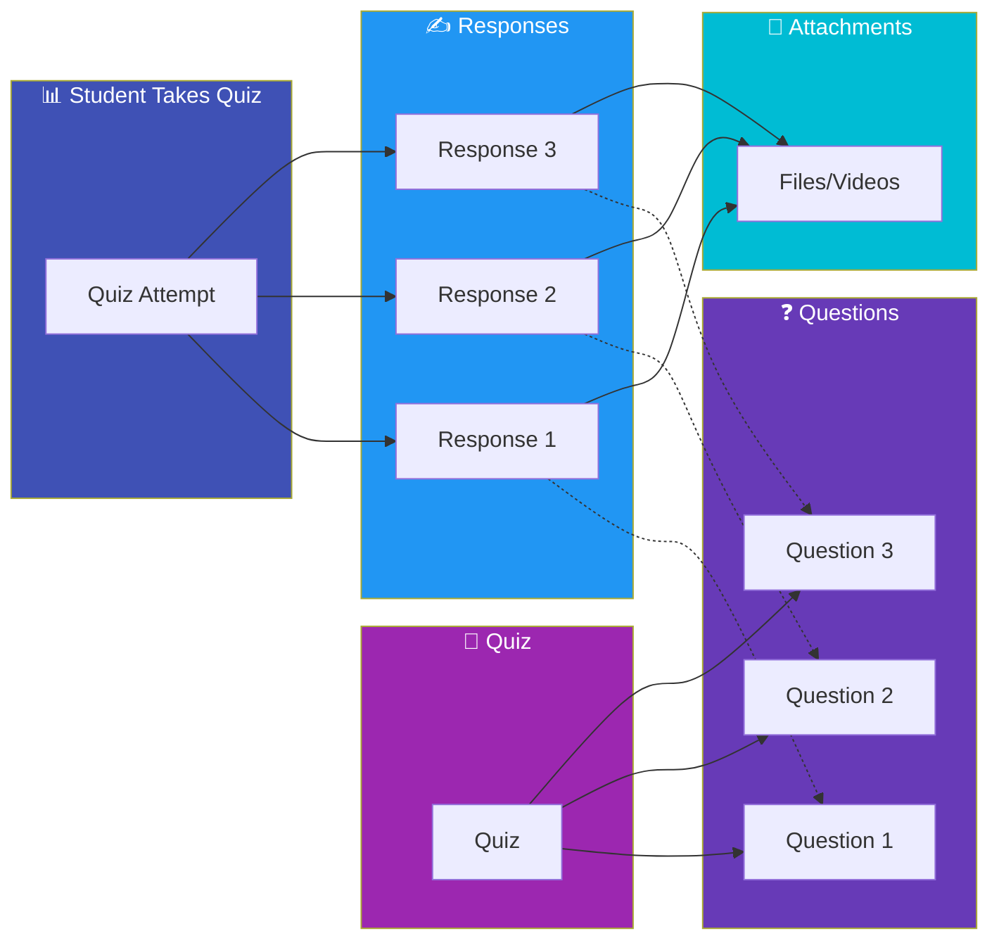

### Quiz ERD

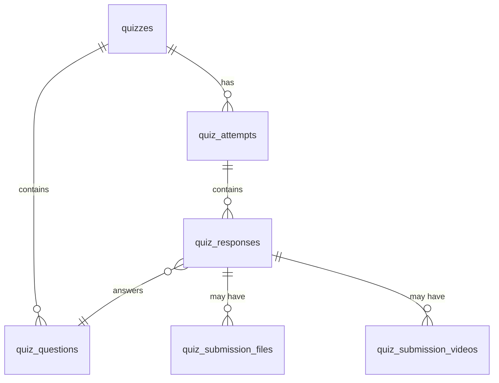

---

### 📋 [quizzes](file:///c:/Users/Emmanuel/Documents/FinalNexskill/nexskill-lms)
> **Purpose:** Quiz/assessment definition

| Column | Type | Description |
|--------|------|-------------|
| `id` | uuid (PK) | Unique quiz identifier |
| `title` | text | Quiz title |
| `description` | text | Quiz description |
| `instructions` | text | Instructions for students |
| `passing_score` | integer | Minimum score to pass (0-100%) |
| `time_limit_minutes` | integer | Time limit (null = unlimited) |
| `max_attempts` | integer | Maximum retry attempts |
| `requires_manual_grading` | boolean | Needs human review? |
| `is_published` | boolean | Available to students? |
| `available_from` | timestamp | When quiz becomes available |
| `due_date` | timestamp | Submission deadline |
| `late_submission_allowed` | boolean | Accept late submissions? |
| `late_penalty_percent` | integer | Penalty for late submission |

---

### 📋 [quiz_questions](file:///c:/Users/Emmanuel/Documents/FinalNexskill/nexskill-lms)
> **Purpose:** Individual questions within a quiz

| Column | Type | Description |
|--------|------|-------------|
| `id` | uuid (PK) | Unique question identifier |
| `quiz_id` | uuid (FK→quizzes) | Parent quiz |
| `position` | integer | Question order |
| `question_type` | text | Type of question (see below) |
| `points` | integer | Point value |
| `question_content` | jsonb | The actual question (rich text blocks) |
| `answer_config` | jsonb | Correct answer(s) and grading rules |
| `requires_manual_grading` | boolean | Needs human review? |
| `max_attempts` | integer | Retries for this question |

**Question Types:**
| Type | Description | Auto-Graded? |
|------|-------------|--------------|
| `multiple_choice` | Select one or more options | ✅ Yes |
| `true_false` | True or False | ✅ Yes |
| `short_answer` | Text response (brief) | ⚠️ Depends |
| `essay` | Long-form text response | ❌ No |
| `file_upload` | Upload a file | ❌ No |
| `video_submission` | Record/upload video | ❌ No |

---

### 📋 [quiz_attempts](file:///c:/Users/Emmanuel/Documents/FinalNexskill/nexskill-lms)
> **Purpose:** Tracks each time a student takes a quiz

| Column | Type | Description |
|--------|------|-------------|
| `id` | uuid (PK) | Unique attempt identifier |
| `user_id` | uuid (FK→auth.users) | Student taking quiz |
| `quiz_id` | uuid (FK→quizzes) | Quiz being taken |
| `attempt_number` | integer | Which attempt (1st, 2nd, etc.) |
| `status` | text | `in_progress`, `submitted`, `graded` |
| `score` | integer | Earned points |
| `max_score` | integer | Maximum possible points |
| `passed` | boolean | Met passing threshold? |
| `started_at` | timestamp | When attempt began |
| `submitted_at` | timestamp | When submitted |
| `graded_at` | timestamp | When graded |
| `graded_by` | uuid | Who graded (if manual) |

---

### 📋 [quiz_responses](file:///c:/Users/Emmanuel/Documents/FinalNexskill/nexskill-lms)
> **Purpose:** Individual answers to each question

| Column | Type | Description |
|--------|------|-------------|
| `id` | uuid (PK) | Unique response identifier |
| `attempt_id` | uuid (FK→quiz_attempts) | Parent attempt |
| `question_id` | uuid (FK→quiz_questions) | Question answered |
| `response_data` | jsonb | Student's answer |
| `points_earned` | integer | Points received |
| `points_possible` | integer | Maximum points |
| `is_correct` | boolean | Correct answer? |
| `requires_grading` | boolean | Needs human review? |
| `grader_feedback` | text | Feedback from grader |
| `graded_at` | timestamp | When graded |

---

### 📋 [quiz_submission_files](file:///c:/Users/Emmanuel/Documents/FinalNexskill/nexskill-lms) & [quiz_submission_videos](file:///c:/Users/Emmanuel/Documents/FinalNexskill/nexskill-lms)
> **Purpose:** Store file and video uploads for quiz responses

These tables store metadata for uploaded files:
- `response_id` → Links to the quiz response
- `bucket_path` → Storage location
- `file_name`, `file_size_bytes`, `mime_type` → File metadata
- Video table also has: `duration_seconds`, `thumbnail_path`, `processing_status`

---

## 🏷️ Category 4: Taxonomies & Lookup Tables

These are "reference tables" used for categorization and tagging.

### Taxonomy Overview

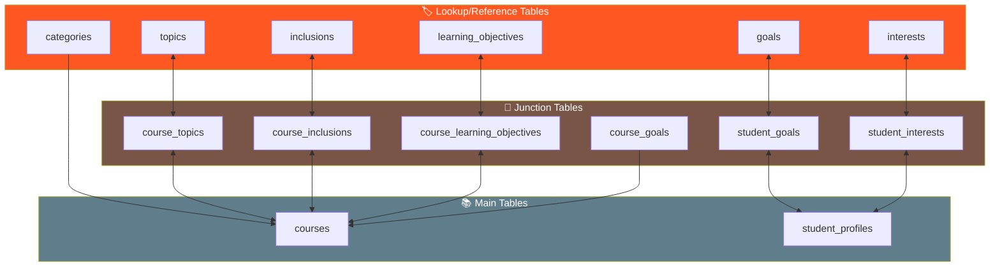

---

### 📋 [categories](file:///c:/Users/Emmanuel/Documents/FinalNexskill/nexskill-lms)
> **Purpose:** Course categories (like departments/subjects)

| Column | Type | Description |
|--------|------|-------------|
| `id` | bigint (PK) | Auto-incrementing ID |
| `name` | text | Category name (unique) |
| `slug` | text | URL-friendly name (unique) |
| `created_at` | timestamp | Creation time |

**Examples:** "Web Development", "Data Science", "Digital Marketing"

---

### 📋 [topics](file:///c:/Users/Emmanuel/Documents/FinalNexskill/nexskill-lms)
> **Purpose:** Specific skills/technologies courses cover

| Column | Type | Description |
|--------|------|-------------|
| `id` | bigint (PK) | Auto-incrementing ID |
| `name` | text | Topic name (unique) |

**Examples:** "React", "Python", "SEO", "Machine Learning"

---

### 📋 [inclusions](file:///c:/Users/Emmanuel/Documents/FinalNexskill/nexskill-lms)
> **Purpose:** What's included with the course

**Examples:** "Certificate of Completion", "Lifetime Access", "Downloadable Resources"

---

### 📋 [learning_objectives](file:///c:/Users/Emmanuel/Documents/FinalNexskill/nexskill-lms)
> **Purpose:** What students will learn

| Column | Type |
|--------|------|
| `id` | bigint (PK) |
| `objective_text` | text |

---

### 📋 [goals](file:///c:/Users/Emmanuel/Documents/FinalNexskill/nexskill-lms) & [interests](file:///c:/Users/Emmanuel/Documents/FinalNexskill/nexskill-lms)
> **Purpose:** Predefined goals and interests for student onboarding

Both tables have similar structure with `name`, `display_order`, and `is_active` fields.

---

### Junction Tables for Courses

| Table | Connects | Purpose |
|-------|----------|---------|
| `course_topics` | courses ↔ topics | What topics a course covers |
| `course_inclusions` | courses ↔ inclusions | What's included with a course |
| `course_learning_objectives` | courses ↔ learning_objectives | Course learning outcomes |
| `course_goals` | courses → goals | Course-specific goals (with position & description) |

---

## 📊 Category 5: Progress & Enrollment

Tracking student progress through courses.

### Progress Flow

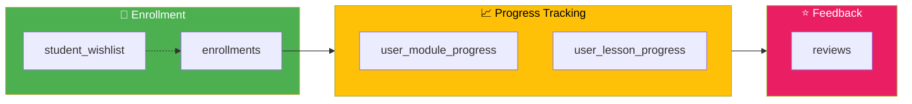

### Progress ERD

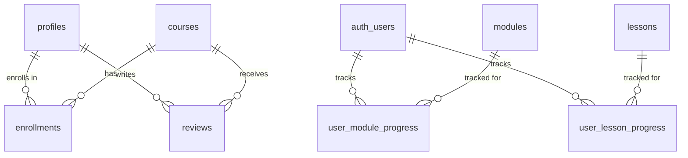

---

### 📋 [enrollments](file:///c:/Users/Emmanuel/Documents/FinalNexskill/nexskill-lms)
> **Purpose:** Links students to courses they've enrolled in

| Column | Type | Description |
|--------|------|-------------|
| `profile_id` | uuid (PK, FK→profiles) | Student |
| `course_id` | uuid (PK, FK→courses) | Course |
| `enrolled_at` | timestamp | Enrollment date |

> [!IMPORTANT]
> This table has a **composite primary key** - `(profile_id, course_id)` together must be unique. A student can only enroll in a course once.

---

### 📋 [user_lesson_progress](file:///c:/Users/Emmanuel/Documents/FinalNexskill/nexskill-lms)
> **Purpose:** Tracks completion of individual lessons

| Column | Type | Description |
|--------|------|-------------|
| `id` | uuid (PK) | Unique identifier |
| `user_id` | uuid (FK→auth.users) | Student |
| `lesson_id` | uuid (FK→lessons) | Lesson |
| `is_completed` | boolean | Completed? |
| `completed_at` | timestamp | Completion timestamp |
| `time_spent_seconds` | integer | Time spent |

---

### 📋 [user_module_progress](file:///c:/Users/Emmanuel/Documents/FinalNexskill/nexskill-lms)
> **Purpose:** Tracks overall module completion percentage

| Column | Type | Description |
|--------|------|-------------|
| `id` | uuid (PK) | Unique identifier |
| `user_id` | uuid (FK→auth.users) | Student |
| `module_id` | uuid (FK→modules) | Module |
| `completion_percentage` | integer | 0-100% |
| `completed_at` | timestamp | Full completion timestamp |

---

### 📋 [student_wishlist](file:///c:/Users/Emmanuel/Documents/FinalNexskill/nexskill-lms)
> **Purpose:** Courses students want to take later

Stores `user_id` and `course_id` with timestamps.

---

### 📋 [reviews](file:///c:/Users/Emmanuel/Documents/FinalNexskill/nexskill-lms)
> **Purpose:** Course ratings and reviews from students

| Column | Type | Description |
|--------|------|-------------|
| `id` | bigint (PK) | Review ID |
| `course_id` | uuid (FK→courses) | Reviewed course |
| `profile_id` | uuid (FK→profiles) | Reviewer |
| `rating` | smallint | 1-5 stars |
| `comment` | text | Written review |
| `created_at` | timestamp | Review date |

---

## 💬 Category 6: Communication

Messaging and live sessions between users.

### Communication ERD

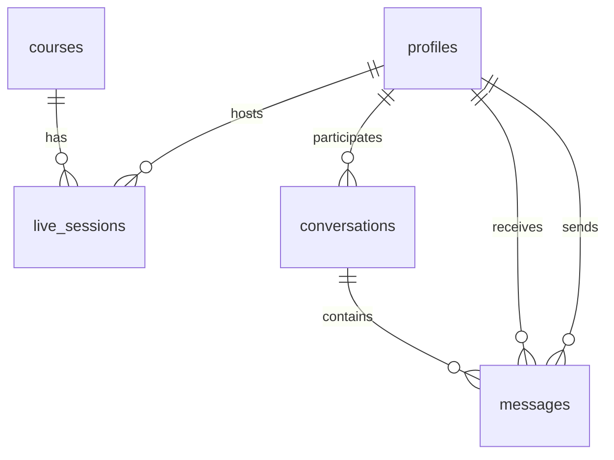

---

### 📋 [messages](file:///c:/Users/Emmanuel/Documents/FinalNexskill/nexskill-lms)
> **Purpose:** Individual messages between users

| Column | Type | Description |
|--------|------|-------------|
| `id` | uuid (PK) | Message ID |
| `sender_id` | uuid (FK→auth.users) | Who sent it |
| `recipient_id` | uuid (FK→auth.users) | Who receives it |
| `course_id` | uuid (FK→courses) | Related course (optional) |
| `content` | varchar | Message text |
| `read_at` | timestamp | When recipient read it |
| `created_at` | timestamp | When sent |

---

### 📋 [conversations](file:///c:/Users/Emmanuel/Documents/FinalNexskill/nexskill-lms)
> **Purpose:** Thread of messages between two users

| Column | Type | Description |
|--------|------|-------------|
| `id` | uuid (PK) | Conversation ID |
| `user1_id` / `user2_id` | uuid (FK→profiles) | Participants |
| `last_message_id` | uuid (FK→messages) | Most recent message |
| `last_message_content` | text | Preview of last message |
| `last_message_at` | timestamp | When last message was sent |
| `last_sender_id` | uuid | Who sent last message |
| `unread_count_user1` / `unread_count_user2` | integer | Unread message counts |
| `course_id` | uuid | Related course (optional) |

> [!TIP]
> The `unread_count` fields provide quick access to badge numbers without counting messages.

---

### 📋 [live_sessions](file:///c:/Users/Emmanuel/Documents/FinalNexskill/nexskill-lms)
> **Purpose:** Scheduled live video sessions for courses

| Column | Type | Description |
|--------|------|-------------|
| `id` | uuid (PK) | Session ID |
| `course_id` | uuid (FK→courses) | Related course |
| `coach_id` | uuid (FK→profiles) | Session host |
| `title` | text | Session title |
| `description` | text | Session description |
| `scheduled_at` | timestamp | When session is scheduled |
| `duration_minutes` | integer | Expected duration |
| `meeting_link` | text | Video call URL |
| `is_live` | boolean | Currently live? |
| `status` | enum | `scheduled`, `live`, `completed`, `cancelled` |
| `recording_url` | text | Post-session recording |

---

## 🎬 Category 7: Media Management

Video upload and processing infrastructure.

### Video Processing Flow

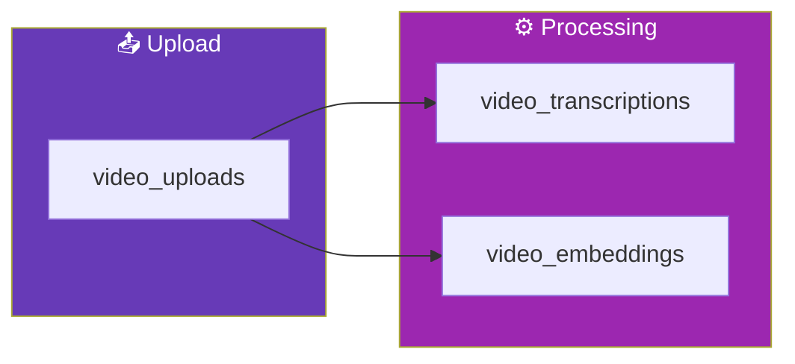

---

### 📋 [video_uploads](file:///c:/Users/Emmanuel/Documents/FinalNexskill/nexskill-lms)
> **Purpose:** Tracks all uploaded videos for lessons or quiz questions

| Column | Type | Description |
|--------|------|-------------|
| `id` | uuid (PK) | Video ID |
| `content_type` | text | `lesson` or `quiz_question` |
| `content_id` | uuid | ID of the lesson or question |
| `bucket_path` | text | Storage path |
| `file_name` | text | Original filename |
| `file_size_bytes` | bigint | File size |
| `mime_type` | text | Video format |
| `duration_seconds` | numeric | Video length |
| `resolution` | text | e.g., "1920x1080" |
| `frame_rate` | numeric | e.g., 30 |
| `codec` | text | e.g., "h264" |
| `processing_status` | text | `pending`, `processing`, `completed`, `failed` |
| `processing_error` | text | Error message if failed |
| `uploaded_by` | uuid | Who uploaded |

---

### 📋 [video_transcriptions](file:///c:/Users/Emmanuel/Documents/FinalNexskill/nexskill-lms)
> **Purpose:** Full text transcripts of videos

| Column | Type | Description |
|--------|------|-------------|
| `video_id` | uuid (FK→video_uploads) | Related video |
| `full_text` | text | Complete transcript |
| `segments` | jsonb | Timestamped segments |
| `language` | text | Transcript language |
| `confidence_score` | numeric | Accuracy confidence |

---

### 📋 [video_embeddings](file:///c:/Users/Emmanuel/Documents/FinalNexskill/nexskill-lms)
> **Purpose:** Vector embeddings for AI-powered video search

| Column | Type | Description |
|--------|------|-------------|
| `video_id` | uuid (FK→video_uploads) | Related video |
| `segment_index` | integer | Segment number |
| `timestamp_start` / `timestamp_end` | numeric | Segment timing |
| `embedding` | vector | AI embedding vector |
| `description` | text | Segment description |
| `transcription` | text | Segment transcript |
| `thumbnail_path` | text | Segment thumbnail |

> [!TIP]
> Embeddings enable semantic search - finding video moments by meaning, not just keywords!

---

## ⚙️ Category 8: Admin & System

### 📋 [admin_verification_feedback](file:///c:/Users/Emmanuel/Documents/FinalNexskill/nexskill-lms)
> **Purpose:** Admin feedback on courses during verification

| Column | Type | Description |
|--------|------|-------------|
| `id` | uuid (PK) | Feedback ID |
| `course_id` | uuid (FK→courses) | Course being reviewed |
| `lesson_id` | uuid (FK→lessons) | Specific lesson (optional) |
| `admin_id` | uuid (FK→auth.users) | Admin who gave feedback |
| `content` | text | Feedback content |
| `is_resolved` | boolean | Has coach addressed it? |
| `created_at` | timestamp | When given |

---

## 🧑‍🏫 Category 9: Sub-Coach Management

The sub-coach system allows coaches to delegate student management to qualified students.

### Sub-Coach Flow

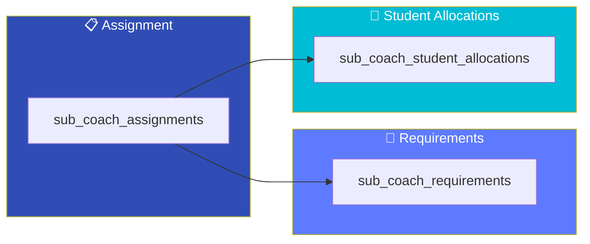

### Sub-Coach ERD

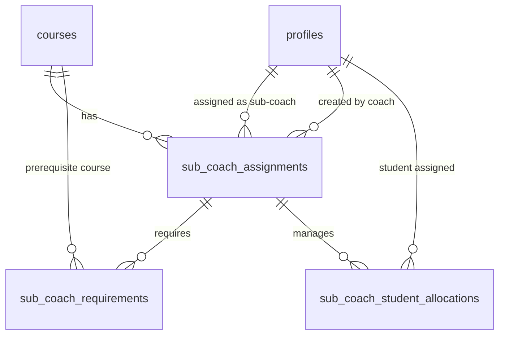

---

### 📋 [sub_coach_assignments](file:///c:/Users/Emmanuel/Documents/FinalNexskill/nexskill-lms)
> **Purpose:** Tracks which students are assigned as sub-coaches for which courses

| Column | Type | Description |
|--------|------|-------------|
| `id` | uuid (PK) | Unique assignment ID |
| `coach_id` | uuid (FK→profiles) | The main coach who created this assignment |
| `sub_coach_id` | uuid (FK→profiles) | The student being assigned as sub-coach |
| `course_id` | uuid (FK→courses) | The course they're sub-coaching for |
| `status` | text | `pending`, `active`, or `inactive` |
| `created_at` | timestamp | When the assignment was created |
| `updated_at` | timestamp | Last update time |

> [!NOTE]
> A student can only be a sub-coach for each course once (unique constraint on `sub_coach_id` + `course_id`).

---

### 📋 [sub_coach_requirements](file:///c:/Users/Emmanuel/Documents/FinalNexskill/nexskill-lms)
> **Purpose:** Stores prerequisite courses required to qualify as a sub-coach (optional)

| Column | Type | Description |
|--------|------|-------------|
| `id` | uuid (PK) | Unique requirement ID |
| `assignment_id` | uuid (FK→sub_coach_assignments) | Which assignment this belongs to |
| `required_course_id` | uuid (FK→courses) | Course that must be completed |
| `created_at` | timestamp | When added |

> [!TIP]
> Requirements are **optional**. Coaches can skip setting requirements and choose any enrolled student as a sub-coach.

---

### 📋 [sub_coach_student_allocations](file:///c:/Users/Emmanuel/Documents/FinalNexskill/nexskill-lms)
> **Purpose:** Tracks which enrolled students are managed by which sub-coach

| Column | Type | Description |
|--------|------|-------------|
| `id` | uuid (PK) | Unique allocation ID |
| `assignment_id` | uuid (FK→sub_coach_assignments) | Which sub-coach assignment |
| `student_id` | uuid (FK→profiles) | The enrolled student being managed |
| `created_at` | timestamp | When allocated |

---

## 🔗 Complete Entity Relationship Diagram

Here's the full database at a glance:

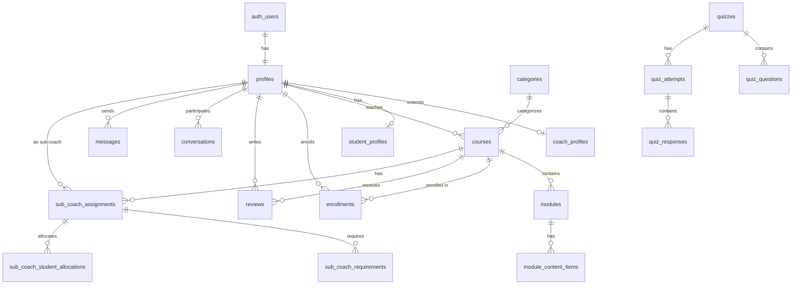

---

## 📋 Quick Reference: All 41 Tables

| # | Table | Category | Purpose |
|---|-------|----------|---------|
| 1 | `profiles` | 👤 User | Core user profiles |
| 2 | `coach_profiles` | 👤 User | Coach-specific info |
| 3 | `student_profiles` | 👤 User | Student-specific info |
| 4 | `student_goals` | 👤 User | Student ↔ Goals junction |
| 5 | `student_interests` | 👤 User | Student ↔ Interests junction |
| 6 | `courses` | 📖 Course | Main course entity |
| 7 | `modules` | 📖 Course | Course sections |
| 8 | `lessons` | 📖 Course | Learning content |
| 9 | `module_content_items` | 📖 Course | Module ↔ Content junction |
| 10 | `module_prerequisites` | 📖 Course | Module dependencies |
| 11 | `quizzes` | ❓ Quiz | Assessment definitions |
| 12 | `quiz_questions` | ❓ Quiz | Individual questions |
| 13 | `quiz_attempts` | ❓ Quiz | Student quiz sessions |
| 14 | `quiz_responses` | ❓ Quiz | Individual answers |
| 15 | `quiz_submission_files` | ❓ Quiz | File attachments |
| 16 | `quiz_submission_videos` | ❓ Quiz | Video submissions |
| 17 | `categories` | 🏷️ Taxonomy | Course categories |
| 18 | `topics` | 🏷️ Taxonomy | Skills/technologies |
| 19 | `inclusions` | 🏷️ Taxonomy | Course inclusions |
| 20 | `learning_objectives` | 🏷️ Taxonomy | Learning outcomes |
| 21 | `goals` | 🏷️ Taxonomy | Student goals |
| 22 | `interests` | 🏷️ Taxonomy | Student interests |
| 23 | `course_topics` | 🏷️ Taxonomy | Course ↔ Topics junction |
| 24 | `course_inclusions` | 🏷️ Taxonomy | Course ↔ Inclusions junction |
| 25 | `course_learning_objectives` | 🏷️ Taxonomy | Course ↔ Objectives junction |
| 26 | `course_goals` | 🏷️ Taxonomy | Course goals |
| 27 | `enrollments` | 📊 Progress | Student course enrollments |
| 28 | `user_lesson_progress` | 📊 Progress | Lesson completion tracking |
| 29 | `user_module_progress` | 📊 Progress | Module completion tracking |
| 30 | `student_wishlist` | 📊 Progress | Saved courses |
| 31 | `reviews` | 📊 Progress | Course ratings |
| 32 | `messages` | 💬 Communication | Direct messages |
| 33 | `conversations` | 💬 Communication | Message threads |
| 34 | `live_sessions` | 💬 Communication | Live video sessions |
| 35 | `video_uploads` | 🎬 Media | Video files |
| 36 | `video_transcriptions` | 🎬 Media | Video transcripts |
| 37 | `video_embeddings` | 🎬 Media | AI video search |
| 38 | `admin_verification_feedback` | ⚙️ Admin | Course review feedback |
| 39 | `sub_coach_assignments` | 🧑‍🏫 Sub-Coach | Sub-coach to course assignments |
| 40 | `sub_coach_requirements` | 🧑‍🏫 Sub-Coach | Prerequisite courses for sub-coach |
| 41 | `sub_coach_student_allocations` | 🧑‍🏫 Sub-Coach | Students managed by sub-coach |

---

## 🎓 Key Relationships Summary

### One-to-One (1:1)
- `auth.users` ↔ `profiles` (every auth user has exactly one profile)
- `profiles` ↔ `coach_profiles` (if user is a coach)
- `video_uploads` ↔ `video_transcriptions`

### One-to-Many (1:N)
- One `category` → Many `courses`
- One `course` → Many `modules`
- One `module` → Many `module_content_items`
- One `quiz` → Many `quiz_questions`
- One `quiz_attempt` → Many `quiz_responses`

### Many-to-Many (M:N) via Junction Tables
- `courses` ↔ `topics` (via `course_topics`)
- `courses` ↔ `inclusions` (via `course_inclusions`)
- `courses` ↔ `learning_objectives` (via `course_learning_objectives`)
- `student_profiles` ↔ `goals` (via `student_goals`)
- `student_profiles` ↔ `interests` (via `student_interests`)
- `profiles` ↔ `courses` for enrollments (via `enrollments`)

---

> [!TIP]
> **Bookmark this document!** It's your complete reference for understanding how the Nexskill LMS database works. 🚀
